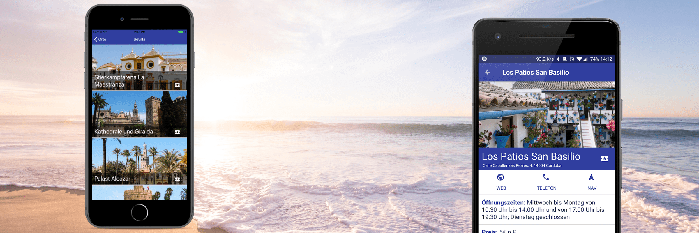

The [Andalusien Rundreise](http://www.andalusienrund-reise.de/) project started as an offer of a friend of mine that needed someone who made an app for a client of his. He needed both, an [Android](https://play.google.com/store/apps/details?id=com.arr) and an [iOS](https://itunes.apple.com/us/app/andalusien-rundreise/id1346610916?platform=iphone&preserveScrollPosition=true#platform/iphone) app and I was eager to make a project in React Native, I had played with it but never build a "real" app. So it was easy for me to accept the project.

It was difficult in some parts but most of the job was easy to achieve. Also, I was able to learn deeply the Unidirectional Architecture, something that I found pretty elegant, simple and powerful. I am looking forward to applying it to an Android project.

I have to say that I love React Native I find it easy for a basic app and not that complicated for a medium one. I don't know if I would recommend it for a big application but for most of the business applications I think is the way to go.

