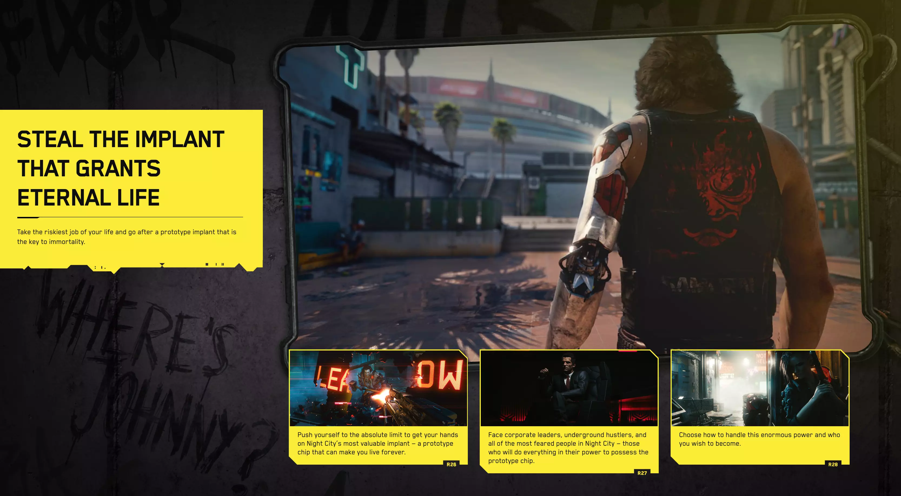

---
title: "hugomatilla.com"
subtitle: Motivation and how I make this site.
image: "../imgs/hugomatilla.webp"
link: /projects/hugomatilla-com
buttonTitle: MORE INFO
priority: 1
badges: [web]
categories: [open]
--- 
### Motivation and how I made this site.

 &nbsp;

I like web technologies even if it is not my expertise field I enjoy making websites. 
# EARLY VERSIONS: 0.0 and 1.0
The first personal website I made was in pure HTML/CSS then I moved to [Jekyll](https://jekyllrb.com/) with github pages.

# MODERN VERSION: 2.0
My former approach was with [Gatsby.js](https://www.gatsbyjs.com/).

I was learning React and being able to have 100% in all [Lighthouse](https://developers.google.com/web/tools/lighthouse/) categories was a plus. 
Moreover, I love the speed that it provides moving between pages, it is instantaneous.  The decision to use Gatsby was easy.

 &nbsp;

For the style, I added Material Design using the [Material Design Lite](https://getmdl.io/) library. 

 &nbsp;

Everything was smooth but I had some problems deploying it to Netlifly via git pushes, so for every update, on the site, I had to build the site locally and drag and drop the public folder to my Netlify project.
That was not ideal but since I was not making updates very often, it was good enough. You can find it [here](https://hugomatilla2.netlify.app/)

# LATEST VERSION: 3.0 Gridsome
Years passed and I decided that I wanted to write Android Articles again. When I wanted to publish my first new article on my Gatsby Site the deploy problem was still there and all my Gatsby dependencies were obsolete. 

 &nbsp;

Since I didn't want to fix a 3 years old site I decide to build a new one from scratch. I loved Gatsby but I don't like that much React. On the other hand, I feel passionate about [Vue](https://vuejs.org/). I am not an expert but I find it easier to use it. 

 &nbsp;

I googled `Gatsby for Vue` and I found [Gridsome](https://gridsome.org/).

 &nbsp;

Gridsome is highly inspired by Gatsby.js. And for the current version 0.7.20, it works perfectly. 
The documentation is still not exhaustive, but it is good enough. And the plugins are very extent. 

## CONTENT
I build it firstly with the older blog in mind. In this one, I wanted to link my medium posts to my site. it was fairly easy with the `source-filesystem` plugin.

 &nbsp;

In my previous Gatsby version, the home content was built directly in the `index.html` file. I wanted to improve it and make it as to the blog posts, in markdown files. Now if I share a new project on my home page I just need to add a new markdown file with its correct header tags.

## STYLE
I was very hyped with the **Cyberpunk 2077** game, I have always been a fan of science fiction, futurism, and cyberpunk aesthetics. The [cyberpunk web site](cyberpunk.net)  was the inspiration for this styling this project.

I used [Bulma](https://bulma.io/) and [Buefy](https://buefy.org/) as my base CSS library, I find it beautifully made and easy to use. 

In the end, I am very happy with the final result, and even if it took me some time, it was not more than a couple of weeks in the afternoons. 

You can finde the code [here](https://github.com/HugoMatilla/hugomatilla.com)

 > My goals to start a new project are always to enjoy doing it and to learn something. I was able to accomplish both in this one.

 

