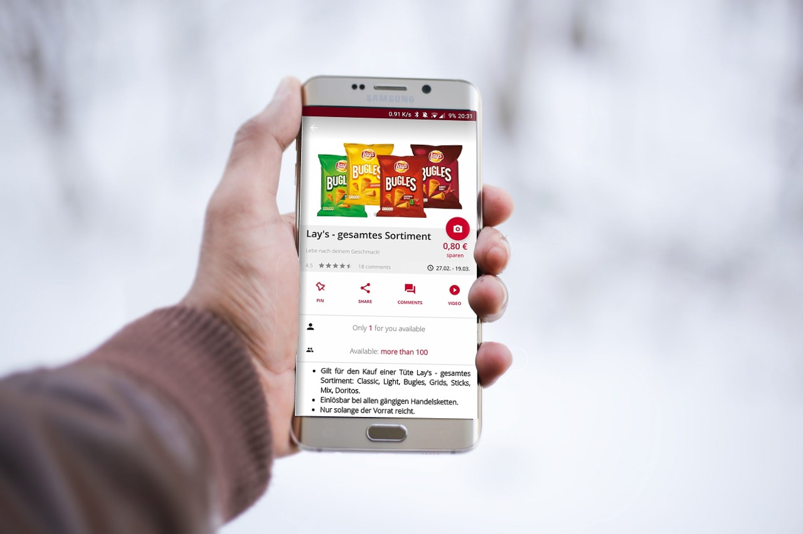

I joined the <b>[scondoo.de](https://scondoo.de)</b>, team soon after they got some VC funding. They needed an in-house Android Developer to help them increase its usability and features.

The project was made by two agencies so the codebase was a bit mixed up. I was able to rapidly get used to the architecture, add new features fast and clean up all the UI.

After a couple of years, and some reading I decided that the application needed an architecture update and I decided to implement the clean architecture in the app and do it using Kotlin. Using Kotlin was a bit risky because it was the beginning of 2016 before Google added it as an official programming language for Android, but after I first use it I knew it would be a matter of time most Android developers will use it as their main language.

After some ups and downs refactoring, that I explain in this talk, I was able to increase the quality of the app and decrease the complexity of the code.

<iframe style="width:1020 !important; height:1000 !important;"  src="https://www.youtube.com/embed/4m774bHxRJE?rel=0" frameborder="0" allow="autoplay; encrypted-media" allowfullscreen></iframe>

The biggest improvements I made to the Scondoo app were:
* Refactor the whole architecture to a "Clean" model.
* Refactor to use Kotlin in all code.
* Add missing tests to the critical parts.
* Migrate the Database from GreenDao to  ROOM (14 tables, 100+ columns).
* Refactor MVP model to LiveData, and ViewModels observing ROOM Queries.

