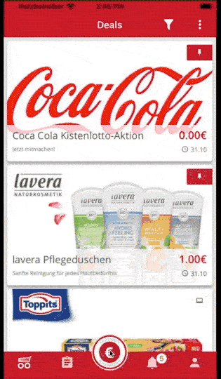

This was a proof of concept. Writing a new scondoo iOS app from scratch. I used RXSwift, CoreData, MVVM and MaterialDesign, following the same architecture I used in the Android version. MVVM which uses cases where observing Database queries.

&nbsp;

The main scondoo features where done. List, detail, login, and redeem a voucher.

&nbsp;

Unfortunately, it was never released.
