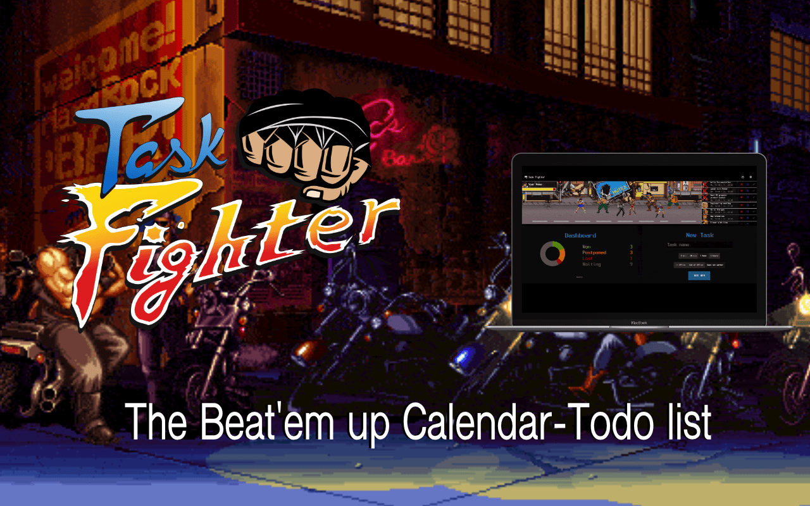

[Task Fighter](https://task-fighter.com) is a web application I made to practice what I learned in NodeJs, MongoDB, and Javascript. I always wanted to make a whole process from idea to release of a web app that everybody could use. It was featured on [Product Hunt](https://www.producthunt.com/posts/task-fighter), got 185 upvotes and some nice comments.

>"This is probably the best implementation of a todo list in years. Kudos for approaching the concept from a new direction."

### From Task Fighter's About page

Task Fighter started after learning and using some productivity planners to achieve goals.(Ink + Volt, Passion Planner, Bullet Journal) and others.

The basics is a Divide and Conquer method for planning:

1. Plan the goals you want to achieve this year.
2. With point 1 in mind, plan this month's tasks to achieve your year goals
3. With point 2 in mind, plan this week's tasks to achieve your month goals
4. Repeat 3, each Sunday/Monday until the end of the month, and start again with 2 at the beginning of the next month

I used google calendar to plan every week, but I wanted something that facilitates me the selection of time slots in the calendar for new tasks that came along during the week.

I don't really care when I have to do something, but I want to know that I have enough time left to do it and that it doesn't collide with other tasks.

So the idea was to have a tool that could add new task rapidly to the calendar. This tool should just with a time length and one parameter (in the office or out of office), add a new task to an empty time slot.

This idea got mixed with my personal love for productivity gamification apps ( Strict Workflow, Build Focus, Forest) and classic arcade games like Final Fight.

With all of this, I thought that it would be super cool to have the "Add Task" tool mixed with a web app that shows you your weekly tasks as a Beat'em Up game. Plus, all of it, connected to your google calendar.

So I made it.

